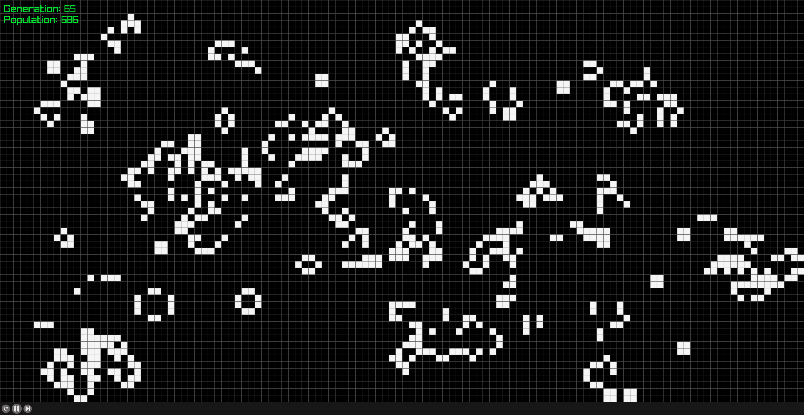

# Conway's Game of Life



An implementation of Conway's Game of Life written in C using the [raylib](https://github.com/raysan5/raylib/tree/master) game development library.

It is designed to be compiled for Linux desktop operating systems or for browsers via emcc to WASM.

## WASM
Compile for web usage.
```bash
# Compile & install raylib (WASM)
git clone --depth 1 https://github.com/raysan5/raylib.git lib/raylib
cd lib/raylib/src/
make PLATFORM=PLATFORM_WEB

# Compile
make PLATFORM=PLATFORM_WEB

# Serve files via webserver
python -m http.server -d out/
```

## Desktop
Compile for desktop usage.
```bash
# Compile & install raylib
git clone --depth 1 https://github.com/raysan5/raylib.git raylib
cd raylib/src/
make PLATFORM=PLATFORM_DESKTOP
sudo make install

# Compile
make PLATFORM=PLATFORM_DESKTOP

# Execute the binary
./bin/conway
```
